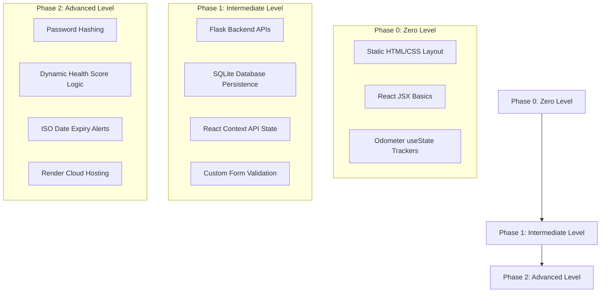

# FleetKeep: Comprehensive Study Guide & Portfolio Documentation
*S2 MCA Internship Presentation Guide — Zero to Advanced Web Development*

---

## Part 1: Strategic Response to Mentor/Startup Owner Feedback

When presenting your work to your internship mentor or startup owner, it is critical to address their feedback professionally. The goal is to shift the conversation from theory to **practical capability** by showing them a functional prototype.

### Email/Slack Reply Template
You can copy, customize, and send this reply to your mentor:

```text
Dear [Mentor's Name],

Thank you for your candid feedback during our last review. I took your points seriously and realized that I focused too much on theoretical concepts rather than demonstrating practical, industry-aligned development skills. 

To address this, I have built a fully functional full-stack prototype called "FleetKeep"—a vehicle maintenance and document compliance tracker designed for everyday vehicle owners. 

The stack consists of:
- Frontend: React 19 (built using Vite) with a polished, glassmorphic dark-theme UI.
- State Management: React Context API for global session and data sync.
- Backend: Python (Flask) with SQLite for data persistence.
- Security: Client-side registration/login validation, password hashing (using Werkzeug security), and route-level user data isolation.

I have also documented the architectural decisions, build phases (from basic static views to secure stateful CRUD), and a complete study guide connecting our academic syllabus (DOM, state management, build tools, microservices) to this real-world codebase.

I am ready to demonstrate this running application, show you the code implementation, and discuss my backend API routes and frontend state lifecycle in our next meeting. I would appreciate 10 minutes to present this prototype and demonstrate the progress I've made.

Thank you again for steering me in the right direction.

Best regards,
[Your Name]
S2 MCA Intern
```

---

## Part 2: Is This Application Okay for a Demo?
**Yes, absolutely.** This application is excellent for an internship demo because:
1. **Solves a Real-World Problem**: Vehicle compliance is a real headache. Missing an insurance renewal or pollution test results in steep government fines. FleetKeep automates alerts for these documents and calculates a dynamic "Health Score."
2. **Complete Full-Stack CRUD**: It covers all CRUD operations:
   - **Create**: Add a new vehicle (validating plate formats like `KL-35-B-5678`).
   - **Read**: Fetch and display vehicle lists and document status filtered by the logged-in user.
   - **Update**: Edit vehicle odometer, next service target, or change certificate expiry dates.
   - **Delete**: "Decommission" (remove) a vehicle from the active garage database.
3. **Enterprise-Grade UI**: The design features a modern dark-mode gradient backdrop, micro-interactions (hover borders, shadow glows), and a responsive layout (works on mobile/tablet).
4. **Security Conscious**: Unlike naive school projects, passwords are never stored in plain text (hashing is used), forms are strictly validated (e.g., odometer numbers can't be negative, next service km must be greater than current odometer), and database commands are protected against basic unauthorized access.

---

## Part 3: Deep-Dive Concept Explanations (Linked to FleetKeep)

Your presentation must link theory directly to the code. Here is how to explain each concept to your mentor.

### 1. What is React.js?
**React.js** is an open-source JavaScript library developed by Meta (Facebook) for building component-based, declarative, and highly interactive user interfaces (UIs). 

* **Academic definition**: A library that uses a Virtual DOM and declarative syntax (JSX) to sync UI updates with data changes efficiently.
* **Real-world example in FleetKeep**:
  In a traditional JavaScript app, if a user changes the registration plate input, you would write:
  ```javascript
  document.getElementById('reg-input').addEventListener('input', (e) => {
      document.getElementById('preview-plate').innerText = e.target.value;
  });
  ```
  This is *imperative* and prone to breaking. In React, we write *declaratively*:
  ```jsx
  const [regNumber, setRegNumber] = useState('');
  // UI automatically rerenders when regNumber changes:
  <input value={regNumber} onChange={(e) => setRegNumber(e.target.value)} />
  <p>{regNumber}</p>
  ```
  React abstracts away the direct DOM manipulations, keeping the UI in sync with the state.

---

### 2. What is the DOM & COM?
These two terms sound similar but belong to entirely different computing spaces. Mentors sometimes ask this to test if a student has memorized buzzwords or actually understands browser environments.

* **DOM (Document Object Model)**:
  The browser's internal tree structure representing the HTML of a webpage. If you have an `<h1>` tag inside a `<div>`, the DOM represents this as parent and child nodes.
  * *React & the DOM*: Directly editing the DOM is slow. React uses a **Virtual DOM (VDOM)**—a lightweight, in-memory copy of the real DOM. When state changes, React updates the VDOM, compares it to the previous version (a process called "diffing"), and updates only the changed parts of the real DOM (a process called "reconciliation").
  * *Code Connection*: In [main.jsx](file:///c:/Users/Lenovo/OneDrive/Desktop/fleetkeep/frontend/src/main.jsx#L53-L57), the line `ReactDOM.createRoot(document.getElementById('root')).render(...)` is where React hooks its Virtual DOM tree onto the browser's physical DOM element containing `id="root"`.

* **COM (Component Object Model)**:
  This is a platform-independent, distributed, object-oriented system created by Microsoft to allow software components to communicate (e.g., how MS Excel speaks to MS Word). **COM is completely unrelated to web browsers or React.js.**
  * *Why this matters*: In Web Development discussions, if you mention COM in the context of React, it shows a lack of fundamentals. Instead, we refer to the **React Component Tree** (the hierarchy of elements like `App -> GarageProvider -> MainLayout -> Dashboard`).

---

### 3. What is State Management & How is it Done?
**State** is the memory of a React application. It holds data that changes over time and determines what the UI renders.

In FleetKeep, state management is executed across three levels:
1. **Local State (`useState`)**: Used inside a single component. For example, in [AuthGate.jsx](file:///c:/Users/Lenovo/OneDrive/Desktop/fleetkeep/frontend/src/assets/components/AuthGate.jsx#L7-L10), the state `isLogin` is local. Only the AuthGate needs to know if we are looking at the Login screen or the Sign Up screen.
2. **Context State (`useContext` / Context API)**: Used when state must be shared across many components without "prop-drilling" (passing props down 5 levels).
   * *Code Connection*: Look at [GarageContext.jsx](file:///c:/Users/Lenovo/OneDrive/Desktop/fleetkeep/frontend/src/assets/context/GarageContext.jsx#L5-L13). It provides `user`, `vehicles`, `error`, `loading`, and authentication functions to both `LandingPage`, `AuthGate`, and `Dashboard`.
3. **Global State Manager (e.g., Redux)**: A centralized state library.

---

### 4. What is Redux?
**Redux** is a global state management library designed for large-scale, complex React applications. It enforces a strict, predictable data flow.

#### How Redux Works (The Three Principles):
1. **Single Source of Truth**: The entire state of the application is stored in a single JavaScript object tree called the **Store**.
2. **State is Read-Only**: The only way to change the state is to emit (dispatch) an **Action** (a JS object describing what happened).
3. **Changes are Made with Pure Functions**: You write **Reducers** (pure functions) that take the current state and an action, and return a *new* state.

#### Data Flow comparison (Redux vs Context API):
```
Redux Flow:
[ UI Button Click ] ──► [ Dispatch Action ] ──► [ Reducer ] ──► [ Update Store ] ──► [ UI Rerenders ]

Context API Flow (as in FleetKeep):
[ UI Button Click ] ──► [ Call Context Provider Function ] ──► [ Set React useState Value ] ──► [ UI Rerenders ]
```

*When to use which:*
* Use **Context API** (what FleetKeep uses) for small-to-medium apps where state changes are simple (e.g., logged-in user, themes).
* Use **Redux** for enterprise-scale projects where many independent components need to update state frequently, or when you need advanced debugging features like time-travel debugging.

---

### 5. What is Micro frontend / Micro Web App Architecture?
**Micro Frontend Architecture** is an architectural pattern where a single web application is split into independent sub-apps that can be developed, tested, and deployed by different teams.

* **Monolithic Frontend**: The entire app (Authentication, Dashboard, Payment system) is in a single codebase with one deployment pipeline. (FleetKeep's current setup is a monolithic single-page application).
* **Micro Frontend**:
  - The Authentication team builds the Auth screen as a separate project.
  - The Fleet team builds the Dashboard as a separate project.
  - A **Shell or Host Application** dynamically stitches them together at runtime.

#### Build Tools: Webpack vs Vite
* **Webpack**: The industry-standard bundler. Under Webpack, micro frontends are implemented using **Module Federation**—a feature that allows a compiled Webpack app to dynamically load components from another Webpack app at runtime without rebuilds.
* **Vite**: A modern frontend build tool that uses native ES modules (ESM) during development, making start times instant. Under Vite, micro frontends use plugin-based federation (`@originjs/vite-plugin-federation`).

---

### 6. How a Design is Converted into a Web App
To show engineering maturity, explain the workflow of converting a Figma/mockup design into React code:

1. **Design System Tokenization**: Extract core design details into CSS variables. In FleetKeep's [pages.css](file:///c:/Users/Lenovo/OneDrive/Desktop/fleetkeep/frontend/src/assets/styles/pages.css#L9-L40), colors like dark backdrops and glow gradients are standardized.
2. **Layout & Layout Structuring**: Divide the design into semantic HTML sections (`<nav>`, `<section>`, `<aside>`).
3. **Atomic Component Separation**: Breakdown the UI into components:
   * *Buttons* (e.g., `.landing-cta-btn`)
   - *Inputs* (e.g., `.auth-input`)
   - *Cards* (e.g., Vehicle display cards)
4. **Behavior Addition**: Add state hooks (`useState`) to make buttons clickable and inputs interactive.
5. **API Connection**: Replace mock static data with fetch requests to backend endpoints (as seen in `GarageContext.jsx` fetching `/api/vehicles`).

---

## Part 4: Step-by-Step Implementation Roadmap

If your mentor asks how this was built from scratch, describe this three-phase learning roadmap:



### Phase 0: Zero Level (Getting Started)
* **Goal**: Understand JSX, component rendering, and basic event handling.
* **Steps**:
  1. Build a simple static HTML landing page with placeholders for vehicles.
  2. Transition to React by initializing a Vite template: `npm create vite@latest`.
  3. Create your first React component (`LandingPage.jsx`) using JSX.
  4. Implement basic state: clicking "Log In" changes a boolean state to render a mock form.

### Phase 1: Intermediate Level (Connecting Systems)
* **Goal**: Create RESTful APIs, manage shareable state, and bind forms.
* **Steps**:
  1. Set up a Python Flask server (`app.py`).
  2. Implement an SQLite database connection to create a `vehicles` table.
  3. Write Flask backend routes for GET, POST, PUT, and DELETE.
  4. Create `GarageContext.jsx` to wrap your React components, handling fetch requests to Flask.
  5. Add input validation (ensuring inputs are not empty, checking that odometer km target is greater than current odometer).

### Phase 2: Advanced Level (Security, Algorithms & Production)
* **Goal**: Secure credentials, execute compliance calculations, and host the app.
* **Steps**:
  1. Implement secure password registration with `generate_password_hash` and validation with `check_password_hash` in Flask.
  2. Write the **Vehicle Health Score Algorithm** in [Dashboard.jsx](file:///c:/Users/Lenovo/OneDrive/Desktop/fleetkeep/frontend/src/assets/components/Dashboard.jsx#L25-L71) which checks service milestones and document expiries to render red/orange/green alerts.
  3. Deploy both frontend and backend to Render.

---

## Part 5: Project Local Setup & Deployment Guide

To run this application locally and deploy it successfully:

### 1. Running the Application Locally

#### Setting up the Python Backend:
1. Open a terminal in the project directory and navigate to backend:
   ```bash
   cd backend
   ```
2. Create and activate a Python virtual environment:
   ```bash
   python -m venv venv
   # On Windows:
   venv\Scripts\activate
   ```
3. Install dependencies:
   ```bash
   pip install -r requirements.txt
   ```
4. Run the Flask application:
   ```bash
   python app.py
   ```
   The API server will launch on `http://127.0.0.1:5000`.

#### Setting up the React Frontend:
1. Open a new terminal and navigate to the frontend directory:
   ```bash
   cd frontend
   ```
2. Install npm packages:
   ```bash
   npm install
   ```
3. Launch the development server:
   ```bash
   npm run dev
   ```
   The React application will open on `http://localhost:5173`. Open this URL in your browser to interact with the application.

---

### 2. Hosting the Application on Render

Render is a cloud hosting platform perfect for deploying both parts of this project for free.

#### Step A: Deploying the Backend (Flask API)
1. Push your code repository to GitHub.
2. Log in to [Render](https://render.com) and click **New -> Web Service**.
3. Connect your GitHub repository.
4. Set the following details:
   * **Name**: `fleetkeep-api`
   * **Environment**: `Python`
   * **Region**: Choose closest to you (e.g., Oregon or Singapore)
   * **Branch**: `main`
   * **Root Directory**: `backend` (Important: points Render to run inside the backend folder)
   * **Build Command**: `pip install -r requirements.txt`
   * **Start Command**: `gunicorn app:app`
5. Click **Deploy Web Service**. Render will build the environment, run Flask, and provide a public URL (e.g., `https://fleetkeep-api.onrender.com`).

> [!NOTE]
> Since we use SQLite (`garage.db`), data is saved directly on Render's disk. Free instances delete files on restart. For a permanent production database, you can switch SQLite to a free **Render PostgreSQL** service by changing the connection string in `app.py`.

#### Step B: Updating Frontend Configuration
Once your backend is deployed:
1. Open [GarageContext.jsx](file:///c:/Users/Lenovo/OneDrive/Desktop/fleetkeep/frontend/src/assets/context/GarageContext.jsx#L14).
2. Change the `API_BASE` variable from `http://127.0.0.1:5000/api` to your Render API URL:
   ```javascript
   const API_BASE = 'https://fleetkeep-api.onrender.com/api';
   ```
3. Commit and push this change to GitHub.

#### Step C: Deploying the Frontend (React Client)
1. In Render, click **New -> Static Site**.
2. Connect the same GitHub repository.
3. Configure the static site settings:
   * **Name**: `fleetkeep`
   * **Branch**: `main`
   * **Root Directory**: `frontend` (Important: points Render to run inside the frontend folder)
   * **Build Command**: `npm run build`
   * **Publish Directory**: `dist` (Vite compiles files into the `dist` folder)
4. Click **Deploy Static Site**. Render will compile your React app and provide you with your public user-facing website link!                

In a full-stack React + Flask application, data travels across the network using HTTP (Hypertext Transfer Protocol) requests formatted as JSON (JavaScript Object Notation).

Here is the exact journey of a new vehicle record in FleetKeep:

mermaid
sequenceDiagram
    participant User as Browser (UI Form)
    participant Context as React Context (fetch API)
    participant Flask as Flask Server (app.py)
    participant DB as SQLite (garage.db)
    User->>Context: Click "Register Vehicle" (Form Data payload)
    Context->>Flask: HTTP POST to /api/vehicles (JSON String)
    Note over Context,Flask: Sends: {"brand": "Honda", "name": "Unicorn", ...}
    Flask->>Flask: Parse JSON & Run Validations
    Flask->>DB: INSERT INTO vehicles (...)
    DB-->>Flask: Confirm Write
    Flask-->>Context: HTTP 201 Created (JSON Response)
    Context->>Context: React state updates (vehicles list)
    Context-->>User: UI Rerenders & displays New Vehicle Card
Step-by-Step Code Walkthrough:
Step A: The User submits the Form (Frontend)
In 

Dashboard.jsx
, when you click "Register Vehicle":

The form submission triggers handleAddOrUpdateVehicle(e).
It constructs a JavaScript object called payload:
javascript
const payload = {
  brand: vehicleForm.brand.trim(),
  name: vehicleForm.name.trim(),
  reg_number: vehicleForm.reg_number.trim().toUpperCase(),
  // ... other fields
};
It passes this payload to the context manager: await addVehicle(payload).
Step B: The Context performs the Network Request (Frontend)
In 

GarageContext.jsx
:

addVehicle serializes the payload using JSON.stringify(payload) (which converts the JavaScript object into a raw text string so it can travel over the network).
It sends an asynchronous HTTP request using the browser's native fetch() API:
javascript
const res = await fetch('http://127.0.0.1:5000/api/vehicles', {
  method: 'POST', // Tells the server we are sending new data
  headers: { 'Content-Type': 'application/json' }, // Tells the server this is a JSON string
  body: JSON.stringify({ ...vehicleData, user_id: user.id })
});
Step C: Flask Receives and Saves the Data (Backend)
In 

app.py
:

Flask matches the URL to the route decorator @app.route('/api/vehicles', methods=['POST']).
It extracts the raw JSON string and converts it back into a Python dictionary:
python
data = request.json
brand = data.get('brand')
It performs validations (e.g., checks if model_year is valid).
If everything passes, it writes it to the SQLite database:
python
cursor.execute("INSERT INTO vehicles (user_id, brand, name, ...) VALUES (?, ?, ?, ...)", (...))
It sends back a success response:
python
return jsonify({"message": "Vehicle logged successfully!"}), 201
Step D: UI Sync (Frontend)
Back in 

GarageContext.jsx
, the frontend receives the response. If res.ok is true, it triggers fetchVehicles(). This initiates a GET request to fetch the updated database entries, sets the React state variable vehicles to the new list, and React automatically rerenders the browser screen to show your new vehicle card.

2. Why We Open Split Terminals for Frontend and Backend
When building a full-stack application, the frontend and backend are two separate software applications running on two different execution engines:

System	Technology	Job	Port
Frontend	Node.js / Vite / JavaScript	Compiles React components and serves files to the user's browser.	5173
Backend	Python / Flask	Listens for API calls, validates data, and queries SQLite.	5000
The Technical Reason: "Blocking Processes"
Both npm run dev and python app.py are continuous, long-running processes. They do not run once and exit.

The Flask server runs an infinite loop listening on port 5000 for incoming HTTP requests.
The Vite dev server runs an infinite loop monitoring your frontend code files for changes to immediately refresh your browser (Hot Module Replacement).
Because a terminal window can only run one foreground process at a time, if you start the Flask server (python app.py) in Terminal 1, that terminal is now fully occupied and "blocked" by Python's logs. If you tried to write a command in that same terminal, nothing would happen because the terminal is busy listening for backend requests.

Advantages of Split Terminals:
Concurrency: Runs both engines simultaneously so they can talk to each other in real-time.
Independent Logging:
In the Backend Terminal, you can see network logs (e.g., POST /api/vehicles 201 or trace Python errors).
In the Frontend Terminal, you can see Vite bundling times, compiler warnings, or linter errors.
Control: You can stop and restart the frontend (Ctrl+C) without interrupting your database backend session.


